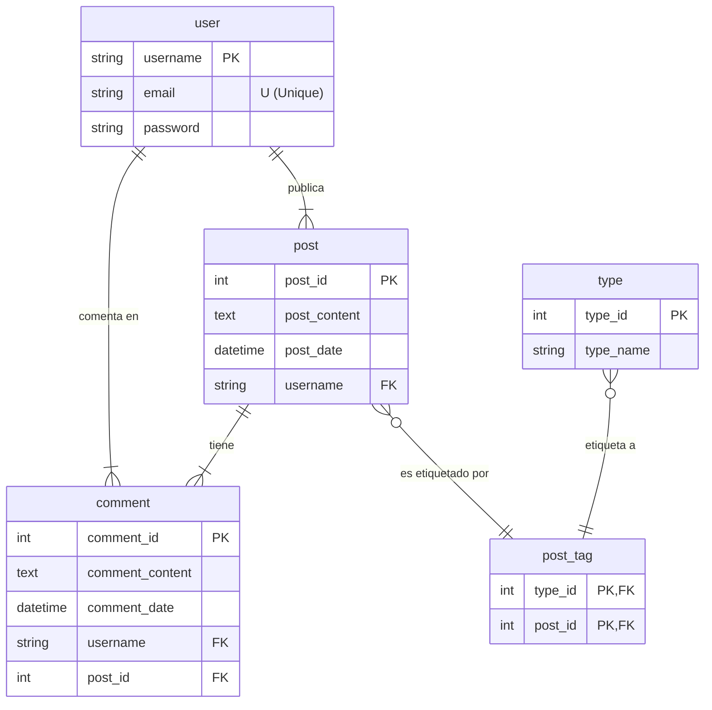

# Plan de Refactorización: Simplificación de Clon de Twitter a un Blog Básico

## 1. Objetivo Principal

Actúa como un arquitecto de software senior. Mi objetivo es simplificar un fork de un clon de Twitter, que actualmente tiene muchas funcionalidades complejas (likes, tendencias, etc.). Quiero transformarlo en una aplicación de social-blogging más minimalista.

La **única fuente de verdad** para la nueva estructura de la base de datos y las funcionalidades permitidas es el siguiente modelo relacional. Cualquier funcionalidad que no pueda ser soportada por este modelo debe ser eliminada.

## 2. Modelo Relacional de Destino (Schema)

El sistema final debe adherirse estrictamente al siguiente esquema de base de datos, descrito en Mermaid:

## 3. Análisis del Modelo y Alcance del Proyecto

Basado en el diagrama anterior, las únicas funcionalidades principales que deben permanecer son:

*   **Gestión de Usuarios**: Registrarse, iniciar sesión (`user`).
*   **Creación de Posts**: Un usuario puede crear un post (`post`).
*   **Comentarios**: Un usuario puede comentar en un post (`comment`).
*   **Etiquetado**: Los posts se pueden asociar con uno o más "tipos" o "hashtags".

Todas las demás funcionalidades deben ser eliminadas. Específicamente, elimina por completo:
*   El sistema de "Seguir" / "Seguidores".
*   Retweets.
*   Mensajes directos.
*   Notificaciones.
*   Trends
*   Perfiles de usuario complejos (biografía, imagen de perfil, banner, etc.).
*   Hilos de tweets (un post no puede ser una respuesta a otro post, solo puede tener comentarios).

## 4. Tareas Solicitadas

Necesito que me proporciones un plan de acción detallado para llevar a cabo esta refactorización. Por favor, estructura tu respuesta de la siguiente manera:

**1. Estrategia de Migración de Base de Datos:**
    *   Describe los pasos para migrar del esquema antiguo al nuevo. ¿Debería crear un script de migración? ¿Qué tablas y columnas debo eliminar?

**2. Refactorización del Backend:**
    *   **Modelos (ORM):** Proporciona ejemplos de cómo deberían verse los nuevos modelos (`User`, `Post`, `Comment`, `Type`, `PostTag`) en mi lenguaje/framework.
    *   **API Endpoints:** Define la nueva lista de endpoints RESTful necesarios. Por ejemplo:
        *   `POST /users/register`
        *   `POST /posts`
        *   `GET /posts`
        *   `GET /posts/{id}`
        *   `POST /posts/{id}/comments`
        *   `GET /posts?type={type_name}` (para filtrar por etiqueta)

**3. Cambios en el Frontend:**
    *   Identifica los componentes de la UI que deben ser eliminados por completo.
    *   Describe qué componentes necesitarán ser modificados.
Hazlo paso por paso.