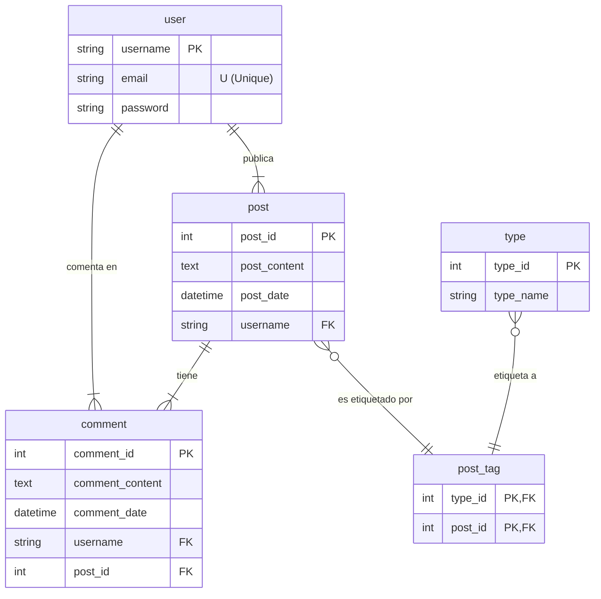

# Plan de Refactorización: Simplificación de Clon de Twitter a un Blog Básico

## 1. Objetivo Principal

Actúa como un arquitecto de software senior, ayudame a crear la funcion de hashtags. 

La **única fuente de verdad** para la nueva estructura de la base de datos y las funcionalidades permitidas es el siguiente modelo relacional.

## 2. Modelo Relacional de Destino (Schema)

El sistema final debe adherirse estrictamente al siguiente esquema de base de datos, descrito en Mermaid:

## 3. Análisis del Modelo y Alcance del Proyecto

Basado en el diagrama anterior, las únicas funcionalidades principales que deben permanecer son:

*   **Gestión de Usuarios**: Registrarse, iniciar sesión (`user`).
*   **Creación de Posts**: Un usuario puede crear un post (`post`).
*   **Comentarios**: Un usuario puede comentar en un post (`comment`).
*   **Types**: Los posts se pueden asociar con uno o más "hashtags", estos se van a encontrar en el mismo textfield del post y debes extraerlo de ahi en base al "#".

## 4. Tareas Solicitadas
Necesito que crees la funcionalidad de los hashtags, que se puedan filtrar y todo lo normal de ellos.