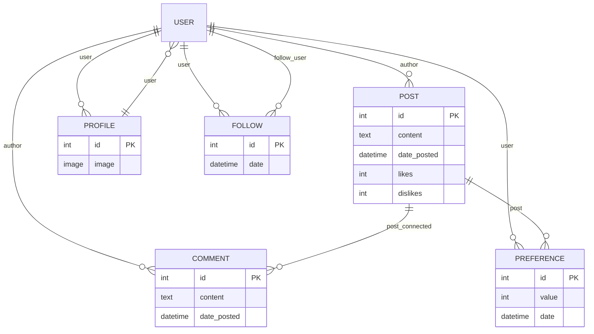

# Modelo Relacional - Django Twitter Clone

## Descripción de las tablas y relaciones

- **User**: Utiliza el modelo estándar de Django.
- **Profile**: Relación uno a uno con User. Almacena la imagen de perfil.
- **Post**: Relación muchos a uno con User (author). Representa los tweets.
- **Comment**: Relación muchos a uno con User (author) y Post (post_connected).
- **Preference**: Relación muchos a uno con User y Post. Guarda likes/dislikes.
- **Follow**: Relación muchos a uno con User (user) y User (follow_user). Representa seguidores y seguidos.
